# retail-analytics-eda   
Retail sales EDA | SQL (data cleaning &amp; prep)  / Power BI (visualization)  |  Covers pricing trends, inventory health, seasonality, and data quality audit.
## ❓ Business Questions 
1. Are prices really growing?  (YoY - Year over Year)
2. Is revenue growth driven by volume or price?
3. Do we have an inventory problem?
4. Does seasonality affect the margin?
5. Do promotions have a negative impact on profit?
6. Which countries are overstocked?  
7. Do we have suspicious data (quality issues)? 
   Should we change the way we collect data? 
   What improvements can we make?  

## 🛠️ Tools Used
- SQL Server (SSMS) — data cleaning & analysis
- Power BI — visualization.

## 📁 Data
Raw data located in `/data/raw/`.
Files provided by mentor for educational purposes only.

## 📂 Data Sources
Raw data files provided by mentor for educational purposes only.

| File | Description |
|------|-------------|
| `inventory_mmmgkubv.csv` | Inventory data |
| `products_mmmgmeum.csv` | Products data |
| `sales_orders.csv` | Sales orders data |

## 📊 Project Steps

1. Sales analysis
2. Visualization & conclusions


## 🗂️ SQL Scripts
- `sql/01_data_preparation.sql` — views and final data preparation for analysis

## 📊 Dashboard
Power BI dashboard covering revenue, seasonality, pricing and discount analysis.

- `dashboard/dashboard.pbix` — full Power BI file (requires Power BI Desktop to open)
- `dashboard/1_dashboard_overview.pdf` — screenshot, Overview page
- `dashboard/2_dashboard_details.pdf` — screenshot, Details page
- `dashboard/dashboard_demo.gif` — short demo of the year filter in action

  ## Data description

This project builds on an earlier stage, where I cleaned and prepared the data. If you'd like to see that process, click [here](https://github.com/MagdalenaSadowska/Retail-Sales-Data-Quality-Preparation).

The dataset consists of three tables: sales_orders, products, and inventory, describing clothing sales across more than a dozen European countries between 2015 and 2024.

sales_orders (255,804 rows): individual orders, with the columns:

- order_id (int) - unique order number

- order_date (date) - order date, format YYYY-MM-DD

- customer_id (int) - customer identifier

- country (nvarchar) - order country, standardized to ISO 3166-1 alpha-2 codes

- product_id (int) - product identifier

- quantity (smallint) - number of items

- unit_price (decimal) - unit price

- discount_pct (decimal) - discount percentage

- status (nvarchar) - order status (SHIPPED, COMPLETED, DONE)

products (2,396 rows) - product dictionary, with the columns:

- product_id (smallint) - product identifier

- category (nvarchar) - category

- sub_category (nvarchar) - subcategory

- base_price (decimal) - base price

- launch_date (date) - product launch date

inventory (3,715 rows): stock levels, with the columns:

- product_id (int) - product identifier

- warehouse_country (nvarchar) - warehouse country, standardized to ISO codes

- stock_quantity (smallint) - quantity in stock

- last_stock_update (date) - date of the last stock update

Known limitations of the dataset (remaining from the data cleaning stage):

- 4 product_id values (412, 1611, 2212, 2398) that appear in sales_orders no longer have a match in products; they were removed from that table due to an unfixable error in the launch_date. When joining these two tables, these records will not get a matched category, subcategory, or base price.

First, I focus on joining the tables in a way that makes the data useful for answering the business questions.

I start by joining the products and sales_orders tables with the following query:

```sql
SELECT sales_orders.product_id, order_date, quantity, unit_price, base_price, status
FROM sales_orders
INNER JOIN products_mmmgmeum ON sales_orders.product_id = products_mmmgmeum.product_id;
```

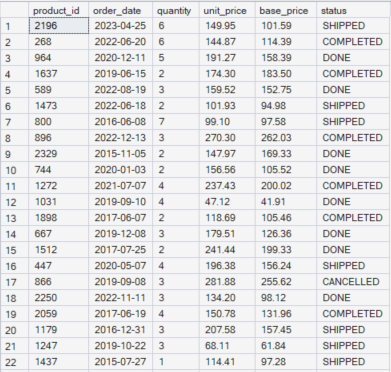

**SCREEN 1:** result of joining the sales_orders and products_mmmgmeum tables

This gives me the table shown, in part, in screen 1. It will help answer, among others, question 4 (Does seasonality affect the margin?), since it brings together in one place the quantity, the selling price, the base price, and the order date.

Since I'll be coming back to this join repeatedly in the further analysis, instead of repeating the same JOIN every time, I save it as a view:

```sql
CREATE OR ALTER VIEW seasonality_VS_margin AS
SELECT sales_orders.product_id, order_date, quantity, unit_price, base_price, status
FROM sales_orders
INNER JOIN products_mmmgmeum ON sales_orders.product_id = products_mmmgmeum.product_id;
```

The query ran successfully. Finally, I make sure the view works correctly and returns the expected data:

```sql
SELECT TOP 10 *
FROM seasonality_VS_margin;
```

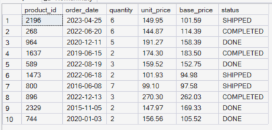

**SCREEN 2:** preview of the first 10 rows of the seasonality_VS_margin view

Since everything looks fine, but after checking the result of the join, I notice that at this stage I won't be able to answer question 4 (Does seasonality affect the margin?), since the necessary information is missing. I do have the base price (base_price), the selling price (unit_price), and the discount (discount_pct). In theory, I could calculate the difference unit_price - base_price, but base_price is most likely a list price, which already includes some margin built in by the company; it isn't the product's manufacturing or purchase cost. Subtracting it from the selling price wouldn't show the actual margin, then, only a shift relative to the list price. My recommendation is to add a separate column with the product's actual cost (e.g. cost_price) to the data, without which a margin analysis in the financial sense isn't possible based on the current dataset.

I move on to the next step. I joined the inventory and sales_orders tables to prepare the data for questions 3 (Do we have an inventory problem?) and 6 (Which countries are overstocked?).

```sql
SELECT *
FROM sales_orders
INNER JOIN inventory_mmmgkubv ON sales_orders.product_id = inventory_mmmgkubv.product_id;
```

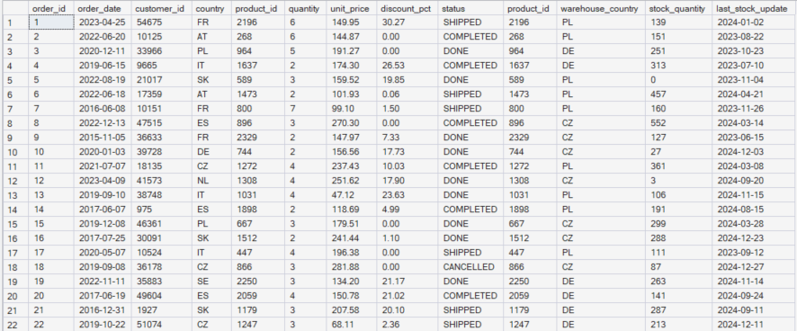

**SCREEN 3:** full result of joining sales_orders and inventory_mmmgkubv

I joined the tables in full, since it was easier for me this way to judge which columns are actually needed for the further analysis and which can be dropped. After reviewing the result, I decided to narrow the query down to the following columns:

```sql
SELECT sales_orders.product_id, order_date, quantity, country, warehouse_country, stock_quantity, last_stock_update
FROM sales_orders
INNER JOIN inventory_mmmgkubv ON sales_orders.product_id = inventory_mmmgkubv.product_id;
```

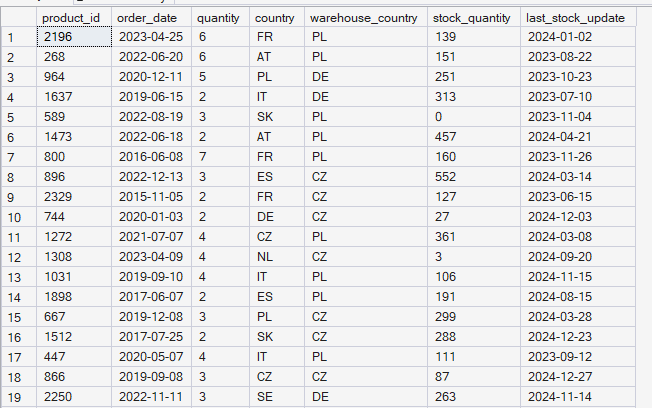

**SCREEN 4:** result of the narrowed-down join, only the columns needed for the further analysis

Just as with the previous join, I save this query as a view, so I can easily refer back to it in the rest of the analysis instead of repeating the same JOIN every time:

```sql
CREATE VIEW sales_inventory AS
SELECT sales_orders.product_id, order_date, quantity, country, warehouse_country, stock_quantity, last_stock_update
FROM sales_orders
INNER JOIN inventory_mmmgkubv ON sales_orders.product_id = inventory_mmmgkubv.product_id;
```

The command ran successfully. Finally, I check whether the newly created sales_inventory view returns the expected data structure:

```sql
SELECT TOP 10 *
FROM sales_inventory;
```

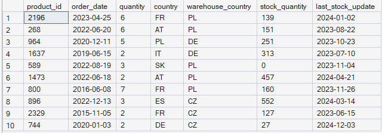

**SCREEN 5:** preview of the first 10 rows of the sales_inventory view, confirming the correct structure

In the next step, I extend the seasonality_VS_margin view with two more columns: category (so I can analyze seasonality broken down by product category) and a calculated revenue column (unit_price * quantity), which I'll need to calculate revenue.

```sql
ALTER VIEW seasonality_VS_margin AS
SELECT sales_orders.product_id, category, order_date, quantity, unit_price, base_price, discount_pct,
       unit_price*quantity AS revenue, status
FROM sales_orders
INNER JOIN products_mmmgmeum ON sales_orders.product_id = products_mmmgmeum.product_id;
```

The command ran successfully. Now that I have the revenue column, I can answer the first research question: are prices really growing year over year (Q1: Are prices really growing? YoY). I check this by summing revenue for each year:

```sql
SELECT YEAR(order_date) AS year, SUM(revenue) AS year_revenue
FROM seasonality_VS_margin
GROUP BY YEAR(order_date)
ORDER BY YEAR(order_date) ASC;
```

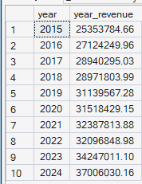

**SCREEN 6:** annual revenue (year_revenue) from 2015 to 2024

The result shows that total revenue grows from about 25.4M in 2015 to about 37.0M in 2024, so the growth is clear and consistent. The revenue growth alone doesn't tell me, though, whether it's driven by rising prices or simply by selling more units, so I check both values separately:

```sql
SELECT YEAR(order_date) AS year, SUM(quantity) AS SUM_QUANTITY, CAST(ROUND(AVG(unit_price),2) AS decimal(10,2)) AS AVG_UNIT_PRICE
FROM seasonality_VS_margin
GROUP BY YEAR(order_date)
ORDER BY YEAR(order_date) ASC;
```

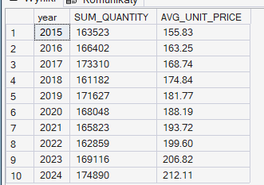

**SCREEN 7:** annual total units sold and average unit price from 2015 to 2024

The result shows that the revenue growth is driven mainly by rising prices, not by sales volume. The quantity sold stays at a similar level, with no clear upward trend, while the average unit price rises consistently from 155.83 in 2015 to 212.11 in 2024. In other words, the company sells roughly the same number of products as before, just at increasingly higher prices.

I think it's worth considering why the company isn't increasing its sales volume. Since the products keep selling well despite the price increases, scaling up production would seem like a natural next step for a business like this.

Next, I check whether the data in sales_inventory even allows for a meaningful analysis of stock levels relative to sales (since I already had doubts about it back during data cleaning), narrowing this down to orders from 2024:

```sql
SELECT product_id,order_date, SUM(quantity)AS SUM_quantity_product, SUM(stock_quantity) AS SUM_STOCK, warehouse_country, last_stock_update
FROM sales_inventory
WHERE YEAR(order_date) IN (2024)
GROUP BY product_id, order_date, last_stock_update, warehouse_country
ORDER BY product_id, order_date ASC;
```

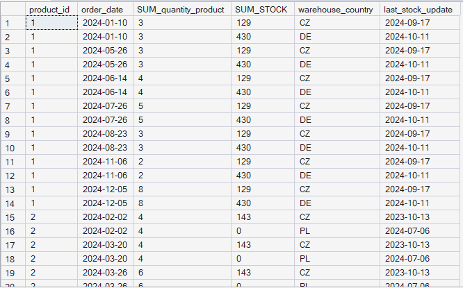

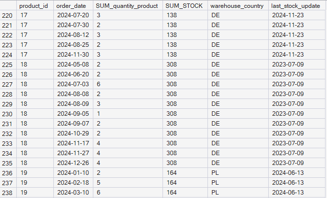

**SCREEN 8:** quantity sold and stock level per product and order date, set alongside the date of the last stock update (2024)

The result reveals two independent problems in the data.

First, the same order row is duplicated once for every warehouse the given product is stored in. For product_id = 1, the same order from January 10, 2024 (3 units) appears twice in the result: once paired with warehouse CZ (129 units in stock), and once with warehouse DE (430 units in stock), each time with the same SUM_quantity_product = 3 value. This happens because the JOIN links the tables solely on product_id, and none of the available tables record which specific warehouse actually fulfilled a given order. As a result, if a product is stored in several warehouses, every one of its orders "multiplies" into as many rows as there are warehouses holding that product, regardless of where the goods were actually shipped from. This is a significant limitation: a simple sum of quantity on this view, without further breakdown, would double (or more) the sales for every product stored in more than one warehouse.

Second, there's a lack of time alignment between order_date and last_stock_update. Stock updates don't keep pace with orders in any predictable direction, sometimes running ahead of the order, sometimes lagging well behind it, in some cases by many months.

Both of these problems limit how reliable a full analysis of stock levels can be, based on the current data. A possible approximation for the first problem would be to add an extra condition to the JOIN, assuming that an order is fulfilled from a warehouse in the same country as the customer's order (country = warehouse_country); but what if the order comes from a country that has no warehouse at all? Then we'd just be guessing, which gives us no real analytical value.

So I decide to check the scale of this problem numerically, rather than relying solely on approximations. First, I check how many products are stored in more than one warehouse in the first place:

```sql
SELECT COUNT(*) AS products_in_multiple_warehouses
FROM (
  SELECT product_id
  FROM inventory_mmmgkubv
  GROUP BY product_id
  HAVING COUNT(DISTINCT warehouse_country) > 1
) t;
```

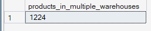

**SCREEN 9:** number of products stored in more than one warehouse

```sql
SELECT COUNT(DISTINCT product_id) AS total_products
FROM inventory_mmmgkubv;
```

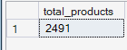

**SCREEN 10:** total number of unique products in the inventory table

The result shows that 1,224 out of 2,491 products (almost half) are stored in more than one warehouse. So the scale of the row-duplication problem from joining on product_id alone is significant, not marginal, which further undermines the usefulness of the country-based approximation proposed earlier.

Next, I go back to the problem of the time mismatch between order_date and last_stock_update, to check how large a share of the data is affected by it:

```sql
SELECT
  COUNT(*) AS total_rows,
  SUM(CASE WHEN ABS(DATEDIFF(DAY, order_date, last_stock_update)) > 365 THEN 1 ELSE 0 END) AS rows_over_1_year,
  CAST(ROUND(
    100.0 * SUM(CASE WHEN ABS(DATEDIFF(DAY, order_date, last_stock_update)) > 365 THEN 1 ELSE 0 END) / COUNT(*)
  , 1) AS decimal(5,1)) AS pct_over_1_year
FROM sales_inventory;
```

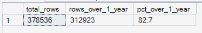

**SCREEN 11:** number and share of rows where the gap between the order date and the stock update date exceeds one year

The result is unambiguous: out of 378,536 rows, as many as 312,923 (82.7%) have a gap between order_date and last_stock_update exceeding one year. This isn't a single exception or a minor inaccuracy. It's the vast majority of the data, which confirms that, in practice, stock levels aren't synchronized with orders.

Finally, I check how large this time gap is on average and at maximum:

```sql
SELECT
  AVG(ABS(DATEDIFF(DAY, order_date, last_stock_update))) AS avg_gap_days,
  MAX(ABS(DATEDIFF(DAY, order_date, last_stock_update))) AS max_gap_days
FROM sales_inventory;
```

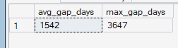

**SCREEN 12:** average and maximum gap in days between the order date and the stock update date

The average gap is 1,542 days (about 4.2 years), and the maximum is as much as 3,647 days (10 years). This ultimately confirms that the stock level data is unreliable as a basis for assessing product availability at the time of a specific order. The time gap is too large and too widespread to be ignored or corrected with any reasonable approximation.

Unfortunately, based on the findings above, I can already see that I won't be able to answer questions 3 (Do we have an inventory problem?) and 6 (Which countries are overstocked?), since the current data doesn't allow it. This comes down to two independent problems, both confirmed numerically, not just suspected.

First, none of the tables indicate which warehouse actually fulfilled a given order. This missing information makes it impossible to unambiguously link an order to a specific stock level and forces the use of approximations that aren't a confirmed fact. The scale of this problem is significant, not marginal: 1,224 out of 2,491 products (almost half) are stored in more than one warehouse, so a JOIN on product_id alone duplicates rows for almost half the assortment. Even the most reasonable approximation I could think of, matching by country (country = warehouse_country), doesn't fully solve the problem: if an order comes from a country with no warehouse at all, such a match is impossible, and guessing the nearest warehouse has no grounding in the data.

Second, stock levels aren't updated at anything close to the pace of orders: 82.7% of rows have a gap between the order date and the last stock update exceeding one year, with an average gap of 4.2 years and a maximum reaching 10 years. Even if the warehouse-assignment problem could be solved, data this outdated still wouldn't allow a reliable assessment of stock levels at the time of a specific order.

Solving these problems at the source would mean adding a column such as warehouse_id directly to sales_orders. This would bring several concrete benefits:

- Eliminating duplication in joins: a JOIN could match an order to exactly one, correct warehouse row, instead of every warehouse the product is stored in, which currently inflates totals artificially during analysis.

- A reliable analysis of stock levels: only by knowing the actual shipping warehouse can you sensibly assess whether a given warehouse has a surplus or shortage of stock relative to real demand.

- Logistics and delivery time analysis: the ability to check whether orders are fulfilled from the nearest warehouse geographically, or from more distant locations (which affects cost and delivery time).

- More precise profitability analysis per location: assigning costs and revenue to a specific warehouse instead of just to the customer's country.

On top of that, it's worth considering changing the way stock levels are recorded, from a single, periodically updated "snapshot" (stock_quantity + last_stock_update) to a warehouse movement log (a transaction log, with every stock receipt and dispatch recorded as a separate, dated entry). This would make it possible to reliably reconstruct the stock level at any point in the past by summing up movements up to that date, instead of relying on a single, often outdated snapshot, which would also directly solve the time-mismatch problem described above.

The next thing I looked at was the seasonality of sales broken down by month, for all products combined:

```sql
SELECT CONCAT(YEAR(order_date), '-', MONTH(order_date)) AS year_month, SUM(quantity) AS SUM_QUANTITY
FROM seasonality_VS_margin
GROUP BY YEAR(order_date), MONTH(order_date)
ORDER BY YEAR(order_date), MONTH(order_date);
```

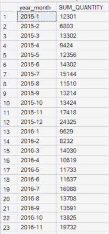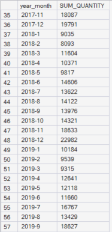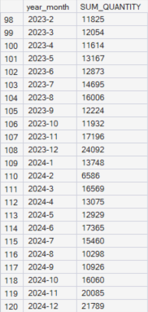

**SCREEN 13:** total units sold broken down by month, 2015-2024 (excerpt of the result)

Even at first glance, sales are clearly higher toward the end of the year (e.g. November-December 2015: 17,418 and 24,325 units, versus about 12-13k in the spring months). The seasonality pattern itself will be much clearer on a chart than in a table of numbers, though, so I leave the full analysis of this trend for the visualization stage.

Next, I examine whether there's a relationship between the size of the discount and sales:

```sql
SELECT CONCAT(YEAR(order_date), '-', MONTH(order_date)) AS year_month, CAST(ROUND(AVG(discount_pct), 2) AS decimal(10,2)) AS AVG_DISCOUNT, SUM(revenue) AS SUM_REVENUE, SUM(quantity) AS SUM_QUANTITY
FROM seasonality_VS_margin
GROUP BY YEAR(order_date), MONTH(order_date)
ORDER BY YEAR(order_date), MONTH(order_date);
```

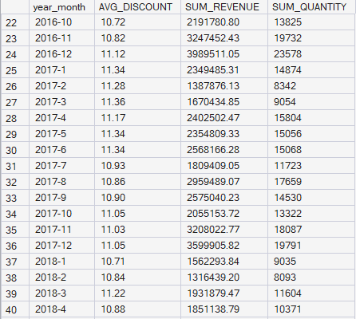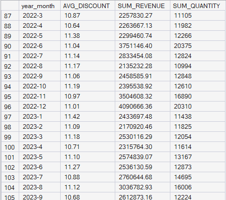

**SCREEN 14:** average discount, revenue, and quantity sold broken down by month

Even from the table alone, there's no clear relationship between discount and sales: the average discount stays at a similar level (about 10.8-11.3%) regardless of the month, even though sales and revenue clearly differ from one another. Something unusual for the clothing industry also stands out: a standard practice is January sales after the holiday season, yet in this data January shows no increase in discount compared to the other months.

To confirm this initial observation numerically, rather than just "by eye", I calculated the Pearson correlation coefficient between the average discount and revenue for a given month:

```sql
SELECT
  (AVG(disc * rev) - AVG(disc) * AVG(rev)) / 
  (STDEVP(disc) * STDEVP(rev)) AS correlation
FROM (
  SELECT
    CONCAT(YEAR(order_date), '-', MONTH(order_date)) AS ym,
    AVG(discount_pct) AS disc,
    SUM(revenue) AS rev
  FROM seasonality_VS_margin
  GROUP BY YEAR(order_date), MONTH(order_date)
) correlation;
```

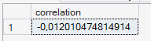

**SCREEN 15:** correlation coefficient between the average discount and revenue

The result is -0.012, essentially zero. This formally confirms what was already visible in the table: there's no meaningful linear relationship between discount size 


