# retail-analytics-eda   
Retail sales EDA | SQL (data cleaning &amp; prep)  / Power BI (visualization)  |  Covers pricing trends, inventory health, seasonality, and data quality audit.
## ❓ Business Questions 
1. Are prices really growing?  (YoY - Year over Year)
2. Is revenue growth driven by volume or price?
3. Do we have an inventory problem?
4. Does seasonality affect the margin?
5. Do promotions have a negative impact on profit?
6. Which countries are overstocked?  
7. Do we have suspicious data (quality issues)? 
   Should we change the way we collect data? 
   What improvements can we make?  

## 🛠️ Tools Used
- SQL Server (SSMS) — data cleaning & analysis
- Power BI — visualization.

## 📁 Data
Raw data located in `/data/raw/`.
Files provided by mentor for educational purposes only.

## 📂 Data Sources
Raw data files provided by mentor for educational purposes only.

| File | Description |
|------|-------------|
| `inventory_mmmgkubv.csv` | Inventory data |
| `products_mmmgmeum.csv` | Products data |
| `sales_orders.csv` | Sales orders data |

## 📊 Project Steps

1. Sales analysis
2. Visualization & conclusions


## 🗂️ SQL Scripts
- `sql/01_data_preparation.sql` — views and final data preparation for analysis

## 📊 Dashboard
Power BI dashboard covering revenue, seasonality, pricing and discount analysis.

- `dashboard/dashboard.pbix` — full Power BI file (requires Power BI Desktop to open)
- `dashboard/1_dashboard_overview.pdf` — screenshot, Overview page
- `dashboard/2_dashboard_details.pdf` — screenshot, Details page
- `dashboard/dashboard_demo.gif` — short demo of the year filter in action

  ## Data description

This project builds on an earlier stage, where I cleaned and prepared the data. If you'd like to see that process, click [here](https://github.com/MagdalenaSadowska/Retail-Sales-Data-Quality-Preparation).

The dataset consists of three tables: sales_orders, products, and inventory, describing clothing sales across more than a dozen European countries between 2015 and 2024.

sales_orders (255,804 rows): individual orders, with the columns:

- order_id (int) - unique order number

- order_date (date) - order date, format YYYY-MM-DD

- customer_id (int) - customer identifier

- country (nvarchar) - order country, standardized to ISO 3166-1 alpha-2 codes

- product_id (int) - product identifier

- quantity (smallint) - number of items

- unit_price (decimal) - unit price

- discount_pct (decimal) - discount percentage

- status (nvarchar) - order status (SHIPPED, COMPLETED, DONE)

products (2,396 rows) - product dictionary, with the columns:

- product_id (smallint) - product identifier

- category (nvarchar) - category

- sub_category (nvarchar) - subcategory

- base_price (decimal) - base price

- launch_date (date) - product launch date

inventory (3,715 rows): stock levels, with the columns:

- product_id (int) - product identifier

- warehouse_country (nvarchar) - warehouse country, standardized to ISO codes

- stock_quantity (smallint) - quantity in stock

- last_stock_update (date) - date of the last stock update

Known limitations of the dataset (remaining from the data cleaning stage):

- 4 product_id values (412, 1611, 2212, 2398) that appear in sales_orders no longer have a match in products; they were removed from that table due to an unfixable error in the launch_date. When joining these two tables, these records will not get a matched category, subcategory, or base price.

First, I focus on joining the tables in a way that makes the data useful for answering the business questions.

I start by joining the products and sales_orders tables with the following query:

```sql
SELECT sales_orders.product_id, order_date, quantity, unit_price, base_price, status
FROM sales_orders
INNER JOIN products_mmmgmeum ON sales_orders.product_id = products_mmmgmeum.product_id;
```

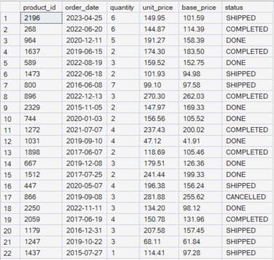

**SCREEN 1:** result of joining the sales_orders and products_mmmgmeum tables

This gives me the table shown, in part, in screen 1. It will help answer, among others, question 4 (Does seasonality affect the margin?), since it brings together in one place the quantity, the selling price, the base price, and the order date.

Since I'll be coming back to this join repeatedly in the further analysis, instead of repeating the same JOIN every time, I save it as a view:

```sql
CREATE OR ALTER VIEW seasonality_VS_margin AS
SELECT sales_orders.product_id, order_date, quantity, unit_price, base_price, status
FROM sales_orders
INNER JOIN products_mmmgmeum ON sales_orders.product_id = products_mmmgmeum.product_id;
```

The query ran successfully. Finally, I make sure the view works correctly and returns the expected data:

```sql
SELECT TOP 10 *
FROM seasonality_VS_margin;
```

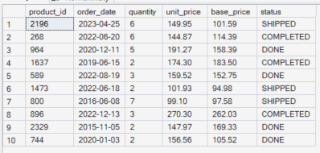

**SCREEN 2:** preview of the first 10 rows of the seasonality_VS_margin view

Since everything looks fine, but after checking the result of the join, I notice that at this stage I won't be able to answer question 4 (Does seasonality affect the margin?), since the necessary information is missing. I do have the base price (base_price), the selling price (unit_price), and the discount (discount_pct). In theory, I could calculate the difference unit_price - base_price, but base_price is most likely a list price, which already includes some margin built in by the company; it isn't the product's manufacturing or purchase cost. Subtracting it from the selling price wouldn't show the actual margin, then, only a shift relative to the list price. My recommendation is to add a separate column with the product's actual cost (e.g. cost_price) to the data, without which a margin analysis in the financial sense isn't possible based on the current dataset.

I move on to the next step. I joined the inventory and sales_orders tables to prepare the data for questions 3 (Do we have an inventory problem?) and 6 (Which countries are overstocked?).

```sql
SELECT *
FROM sales_orders
INNER JOIN inventory_mmmgkubv ON sales_orders.product_id = inventory_mmmgkubv.product_id;
```

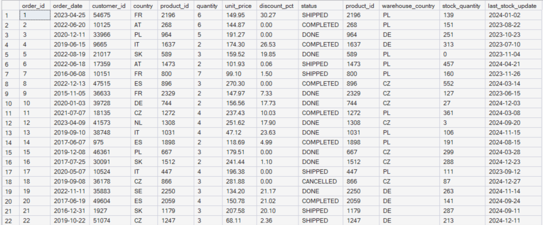

**SCREEN 3:** full result of joining sales_orders and inventory_mmmgkubv

I joined the tables in full, since it was easier for me this way to judge which columns are actually needed for the further analysis and which can be dropped. After reviewing the result, I decided to narrow the query down to the following columns:

```sql
SELECT sales_orders.product_id, order_date, quantity, country, warehouse_country, stock_quantity, last_stock_update
FROM sales_orders
INNER JOIN inventory_mmmgkubv ON sales_orders.product_id = inventory_mmmgkubv.product_id;
```

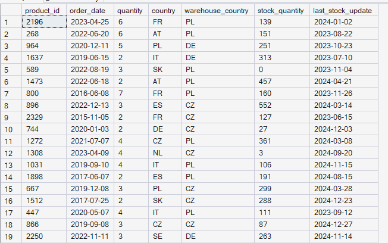

**SCREEN 4:** result of the narrowed-down join, only the columns needed for the further analysis

Just as with the previous join, I save this query as a view, so I can easily refer back to it in the rest of the analysis instead of repeating the same JOIN every time:

```sql
CREATE VIEW sales_inventory AS
SELECT sales_orders.product_id, order_date, quantity, country, warehouse_country, stock_quantity, last_stock_update
FROM sales_orders
INNER JOIN inventory_mmmgkubv ON sales_orders.product_id = inventory_mmmgkubv.product_id;
```

The command ran successfully. Finally, I check whether the newly created sales_inventory view returns the expected data structure:

```sql
SELECT TOP 10 *
FROM sales_inventory;
```

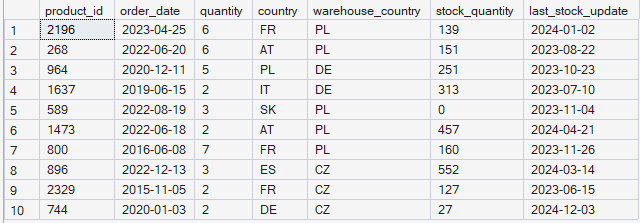

**SCREEN 5:** preview of the first 10 rows of the sales_inventory view, confirming the correct structure

In the next step, I extend the seasonality_VS_margin view with two more columns: category (so I can analyze seasonality broken down by product category) and a calculated revenue column (unit_price * quantity), which I'll need to calculate revenue.

```sql
ALTER VIEW seasonality_VS_margin AS
SELECT sales_orders.product_id, category, order_date, quantity, unit_price, base_price, discount_pct,
       unit_price*quantity AS revenue, status
FROM sales_orders
INNER JOIN products_mmmgmeum ON sales_orders.product_id = products_mmmgmeum.product_id;
```

The command ran successfully. Now that I have the revenue column, I can answer the first research question: are prices really growing year over year (Q1: Are prices really growing? YoY). I check this by summing revenue for each year:

```sql
SELECT YEAR(order_date) AS year, SUM(revenue) AS year_revenue
FROM seasonality_VS_margin
GROUP BY YEAR(order_date)
ORDER BY YEAR(order_date) ASC;
```

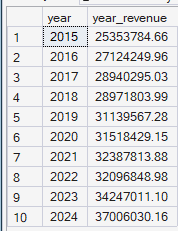

**SCREEN 6:** annual revenue (year_revenue) from 2015 to 2024

The result shows that total revenue grows from about 25.4M in 2015 to about 37.0M in 2024, so the growth is clear and consistent. The revenue growth alone doesn't tell me, though, whether it's driven by rising prices or simply by selling more units, so I check both values separately:

```sql
SELECT YEAR(order_date) AS year, SUM(quantity) AS SUM_QUANTITY, CAST(ROUND(AVG(unit_price),2) AS decimal(10,2)) AS AVG_UNIT_PRICE
FROM seasonality_VS_margin
GROUP BY YEAR(order_date)
ORDER BY YEAR(order_date) ASC;
```

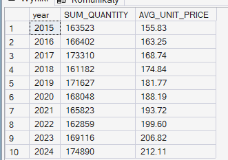

**SCREEN 7:** annual total units sold and average unit price from 2015 to 2024

The result shows that the revenue growth is driven mainly by rising prices, not by sales volume. The quantity sold stays at a similar level, with no clear upward trend, while the average unit price rises consistently from 155.83 in 2015 to 212.11 in 2024. In other words, the company sells roughly the same number of products as before, just at increasingly higher prices.

I think it's worth considering why the company isn't increasing its sales volume. Since the products keep selling well despite the price increases, scaling up production would seem like a natural next step for a business like this.

Next, I check whether the data in sales_inventory even allows for a meaningful analysis of stock levels relative to sales (since I already had doubts about it back during data cleaning), narrowing this down to orders from 2024:

```sql
SELECT product_id,order_date, SUM(quantity)AS SUM_quantity_product, SUM(stock_quantity) AS SUM_STOCK, warehouse_country, last_stock_update
FROM sales_inventory
WHERE YEAR(order_date) IN (2024)
GROUP BY product_id, order_date, last_stock_update, warehouse_country
ORDER BY product_id, order_date ASC;
```

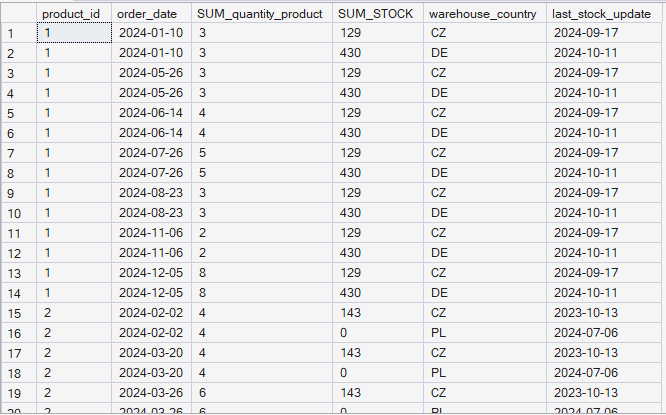

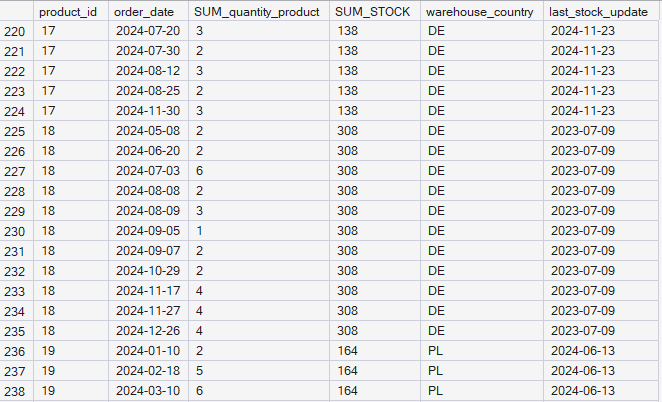

**SCREEN 8:** quantity sold and stock level per product and order date, set alongside the date of the last stock update (2024)

The result reveals two independent problems in the data.

First, the same order row is duplicated once for every warehouse the given product is stored in. For product_id = 1, the same order from January 10, 2024 (3 units) appears twice in the result: once paired with warehouse CZ (129 units in stock), and once with warehouse DE (430 units in stock), each time with the same SUM_quantity_product = 3 value. This happens because the JOIN links the tables solely on product_id, and none of the available tables record which specific warehouse actually fulfilled a given order. As a result, if a product is stored in several warehouses, every one of its orders "multiplies" into as many rows as there are warehouses holding that product, regardless of where the goods were actually shipped from. This is a significant limitation: a simple sum of quantity on this view, without further breakdown, would double (or more) the sales for every product stored in more than one warehouse.

Second, there's a lack of time alignment between order_date and last_stock_update. Stock updates don't keep pace with orders in any predictable direction, sometimes running ahead of the order, sometimes lagging well behind it, in some cases by many months.

Both of these problems limit how reliable a full analysis of stock levels can be, based on the current data. A possible approximation for the first problem would be to add an extra condition to the JOIN, assuming that an order is fulfilled from a warehouse in the same country as the customer's order (country = warehouse_country); but what if the order comes from a country that has no warehouse at all? Then we'd just be guessing, which gives us no real analytical value.

So I decide to check the scale of this problem numerically, rather than relying solely on approximations. First, I check how many products are stored in more than one warehouse in the first place:

```sql
SELECT COUNT(*) AS products_in_multiple_warehouses
FROM (
  SELECT product_id
  FROM inventory_mmmgkubv
  GROUP BY product_id
  HAVING COUNT(DISTINCT warehouse_country) > 1
) t;
```

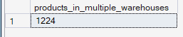

**SCREEN 9:** number of products stored in more than one warehouse

```sql
SELECT COUNT(DISTINCT product_id) AS total_products
FROM inventory_mmmgkubv;
```

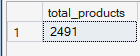

**SCREEN 10:** total number of unique products in the inventory table

The result shows that 1,224 out of 2,491 products (almost half) are stored in more than one warehouse. So the scale of the row-duplication problem from joining on product_id alone is significant, not marginal, which further undermines the usefulness of the country-based approximation proposed earlier.

Next, I go back to the problem of the time mismatch between order_date and last_stock_update, to check how large a share of the data is affected by it:

```sql
SELECT
  COUNT(*) AS total_rows,
  SUM(CASE WHEN ABS(DATEDIFF(DAY, order_date, last_stock_update)) > 365 THEN 1 ELSE 0 END) AS rows_over_1_year,
  CAST(ROUND(
    100.0 * SUM(CASE WHEN ABS(DATEDIFF(DAY, order_date, last_stock_update)) > 365 THEN 1 ELSE 0 END) / COUNT(*)
  , 1) AS decimal(5,1)) AS pct_over_1_year
FROM sales_inventory;
```

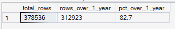

**SCREEN 11:** number and share of rows where the gap between the order date and the stock update date exceeds one year

The result is unambiguous: out of 378,536 rows, as many as 312,923 (82.7%) have a gap between order_date and last_stock_update exceeding one year. This isn't a single exception or a minor inaccuracy. It's the vast majority of the data, which confirms that, in practice, stock levels aren't synchronized with orders.

Finally, I check how large this time gap is on average and at maximum:

```sql
SELECT
  AVG(ABS(DATEDIFF(DAY, order_date, last_stock_update))) AS avg_gap_days,
  MAX(ABS(DATEDIFF(DAY, order_date, last_stock_update))) AS max_gap_days
FROM sales_inventory;
```

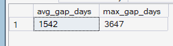

**SCREEN 12:** average and maximum gap in days between the order date and the stock update date

The average gap is 1,542 days (about 4.2 years), and the maximum is as much as 3,647 days (10 years). This ultimately confirms that the stock level data is unreliable as a basis for assessing product availability at the time of a specific order. The time gap is too large and too widespread to be ignored or corrected with any reasonable approximation.

Unfortunately, based on the findings above, I can already see that I won't be able to answer questions 3 (Do we have an inventory problem?) and 6 (Which countries are overstocked?), since the current data doesn't allow it. This comes down to two independent problems, both confirmed numerically, not just suspected.

First, none of the tables indicate which warehouse actually fulfilled a given order. This missing information makes it impossible to unambiguously link an order to a specific stock level and forces the use of approximations that aren't a confirmed fact. The scale of this problem is significant, not marginal: 1,224 out of 2,491 products (almost half) are stored in more than one warehouse, so a JOIN on product_id alone duplicates rows for almost half the assortment. Even the most reasonable approximation I could think of, matching by country (country = warehouse_country), doesn't fully solve the problem: if an order comes from a country with no warehouse at all, such a match is impossible, and guessing the nearest warehouse has no grounding in the data.

Second, stock levels aren't updated at anything close to the pace of orders: 82.7% of rows have a gap between the order date and the last stock update exceeding one year, with an average gap of 4.2 years and a maximum reaching 10 years. Even if the warehouse-assignment problem could be solved, data this outdated still wouldn't allow a reliable assessment of stock levels at the time of a specific order.

Solving these problems at the source would mean adding a column such as warehouse_id directly to sales_orders. This would bring several concrete benefits:

- Eliminating duplication in joins: a JOIN could match an order to exactly one, correct warehouse row, instead of every warehouse the product is stored in, which currently inflates totals artificially during analysis.

- A reliable analysis of stock levels: only by knowing the actual shipping warehouse can you sensibly assess whether a given warehouse has a surplus or shortage of stock relative to real demand.

- Logistics and delivery time analysis: the ability to check whether orders are fulfilled from the nearest warehouse geographically, or from more distant locations (which affects cost and delivery time).

- More precise profitability analysis per location: assigning costs and revenue to a specific warehouse instead of just to the customer's country.

On top of that, it's worth considering changing the way stock levels are recorded, from a single, periodically updated "snapshot" (stock_quantity + last_stock_update) to a warehouse movement log (a transaction log, with every stock receipt and dispatch recorded as a separate, dated entry). This would make it possible to reliably reconstruct the stock level at any point in the past by summing up movements up to that date, instead of relying on a single, often outdated snapshot, which would also directly solve the time-mismatch problem described above.

The next thing I looked at was the seasonality of sales broken down by month, for all products combined:

```sql
SELECT CONCAT(YEAR(order_date), '-', MONTH(order_date)) AS year_month, SUM(quantity) AS SUM_QUANTITY
FROM seasonality_VS_margin
GROUP BY YEAR(order_date), MONTH(order_date)
ORDER BY YEAR(order_date), MONTH(order_date);
```

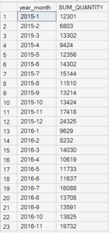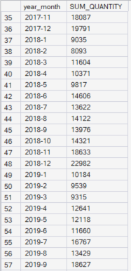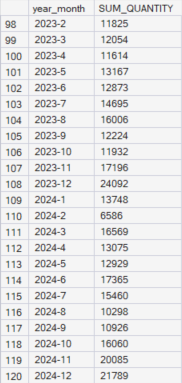

**SCREEN 13:** total units sold broken down by month, 2015-2024 (excerpt of the result)

Even at first glance, sales are clearly higher toward the end of the year (e.g. November-December 2015: 17,418 and 24,325 units, versus about 12-13k in the spring months). The seasonality pattern itself will be much clearer on a chart than in a table of numbers, though, so I leave the full analysis of this trend for the visualization stage.

Next, I examine whether there's a relationship between the size of the discount and sales:

```sql
SELECT CONCAT(YEAR(order_date), '-', MONTH(order_date)) AS year_month, CAST(ROUND(AVG(discount_pct), 2) AS decimal(10,2)) AS AVG_DISCOUNT, SUM(revenue) AS SUM_REVENUE, SUM(quantity) AS SUM_QUANTITY
FROM seasonality_VS_margin
GROUP BY YEAR(order_date), MONTH(order_date)
ORDER BY YEAR(order_date), MONTH(order_date);
```

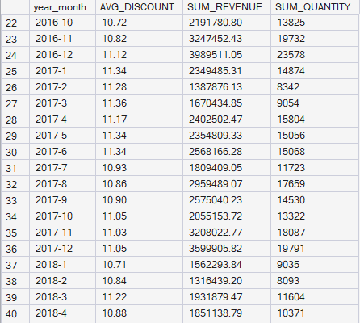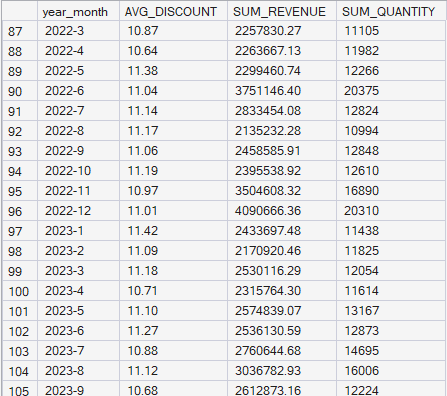

**SCREEN 14:** average discount, revenue, and quantity sold broken down by month

Even from the table alone, there's no clear relationship between discount and sales: the average discount stays at a similar level (about 10.8-11.3%) regardless of the month, even though sales and revenue clearly differ from one another. Something unusual for the clothing industry also stands out: a standard practice is January sales after the holiday season, yet in this data January shows no increase in discount compared to the other months.

To confirm this initial observation numerically, rather than just "by eye", I calculated the Pearson correlation coefficient between the average discount and revenue for a given month:

```sql
SELECT
  (AVG(disc * rev) - AVG(disc) * AVG(rev)) / 
  (STDEVP(disc) * STDEVP(rev)) AS correlation
FROM (
  SELECT
    CONCAT(YEAR(order_date), '-', MONTH(order_date)) AS ym,
    AVG(discount_pct) AS disc,
    SUM(revenue) AS rev
  FROM seasonality_VS_margin
  GROUP BY YEAR(order_date), MONTH(order_date)
) correlation;
```

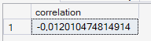

**SCREEN 15:** correlation coefficient between the average discount and revenue

The result is -0.012, essentially zero. This formally confirms what was already visible in the table: there's no meaningful linear relationship between discount size 

## Building the dashboard in Power BI

The next step is to build a dashboard based on the tables prepared earlier in SQL.

My goal with the Power BI dashboard is to visually present the results of the analysis worked out at the SQL stage. Instead of repeating that analytical work here, I focus on clearly showing what has already been done in SQL, in a form that is much easier and faster to take in than raw numbers in a query result table.

I want my dashboard to answer the following business questions:

- Are prices really growing? (YoY - Year over Year)
- Is revenue growth driven by volume or price?
- Is there seasonality in sales?
- Does seasonality affect the margin?
- Do promotions have a negative impact on profit?

As I already know from the earlier analysis, I am not able to answer the questions:

- Do we have an inventory problem?
- Which countries are overstocked?

The reason is the lack of reliable inventory data: as much as 82.7% of records have a gap of more than a year between the order date and the date of the last stock update, and on top of that, joining the tables by product_id duplicates data for almost half of the assortment (products stored in more than one warehouse). Without information on which warehouse actually fulfilled a given order, it is not possible to reliably assess either stock levels or which countries are overstocked.

Additionally, I am not able to fully answer the question "Does seasonality affect the margin?". For that reason, I limit myself here to checking the seasonality of product sales, without analysing margin itself, because, as I established earlier, the data does not contain the actual product cost, which makes it impossible to calculate margin in a financial sense.

First, I import the tables from SQL Server in CSV format, which I will use for the individual business questions.

### Table Q1

I named the first table Q1 and loaded into it a CSV file generated from the query below, on revenue in a given year:

```sql
SELECT YEAR(order_date) AS year,SUM(revenue) AS year_revenue
FROM seasonality_VS_margin
GROUP BY YEAR(order_date)
ORDER BY YEAR(order_date) ASC;
```

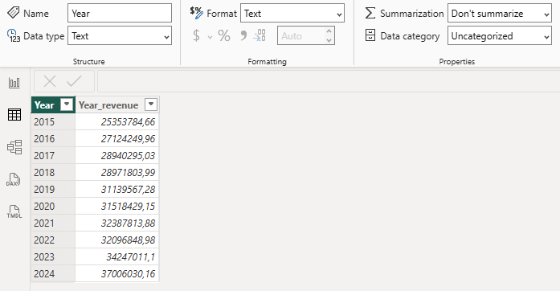

**SCREEN 16:** properties of the Year column in table Q1 (text, no aggregation)

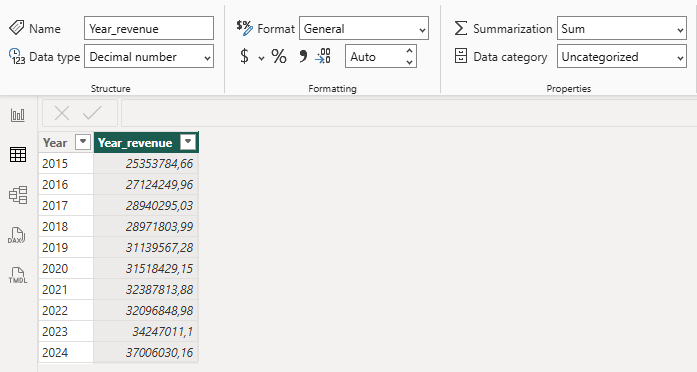

**SCREEN 17:** properties of the Year_revenue column in table Q1 (decimal number, Sum aggregation)

I set the Year column as text, not a whole number or a date. In this context, the year acts as a category for grouping and as the chart axis, not as a value on which arithmetic operations would make sense. Adding or averaging years (e.g. 2015 + 2016) has no business meaning. The text format also prevents Power BI from accidentally aggregating this column (with a whole number, the program might by default suggest summing or averaging the year, which would be meaningless), and on a chart it guarantees a categorical axis with even spacing between years, instead of a continuous axis.

I set the Year_revenue column as a decimal number with the default Sum aggregation. It is a monetary value, so it naturally needs a numeric type. The default "Sum" aggregation ensures that whenever I drag this column into any visual (a card, a chart, a table), Power BI immediately sums the values correctly, instead of defaulting to, say, an average or a row count. This matters especially once the data is additionally filtered or grouped in a visual (e.g. by a slicer), because then Power BI already knows how to sum the result correctly.

### Table Q2

I named the next table Q2 and loaded into it a CSV file generated from the query below, checking the total quantity sold and the average unit price in a given year:

```sql
SELECT YEAR(order_date) AS year,SUM(quantity) AS SUM_QUANTITY, CAST(ROUND(AVG(unit_price),2)AS decimal(10,2)) AS AVG_UNIT_PRICE
FROM seasonality_VS_margin
GROUP BY YEAR(order_date)
ORDER BY YEAR(order_date) ASC;
```

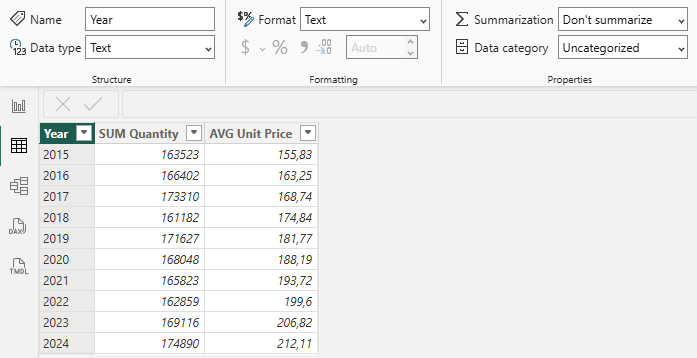

**SCREEN 18:** properties of the Year column in table Q2 (text, no aggregation)

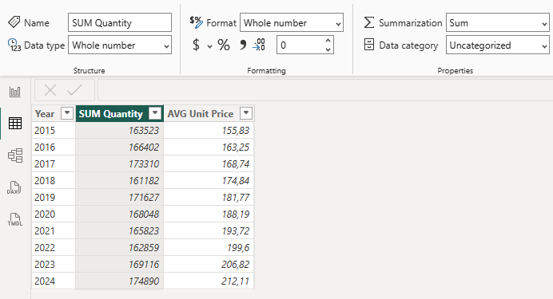

**SCREEN 19:** properties of the SUM Quantity column in table Q2 (whole number, Sum aggregation)

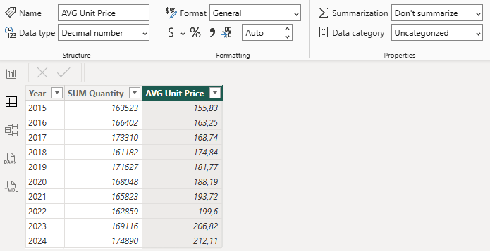

**SCREEN 20:** properties of the AVG Unit Price column in table Q2 (decimal number, Don't summarize aggregation)

I checked the naming and format of the columns.

I set the Year column as text, for the same reason as in the previous table. Here the year acts as an axis category, not as a numeric value on which arithmetic would make sense.

I set the SUM Quantity column as a whole number with Sum aggregation. It is the sum of units sold, so by nature it is a whole-number value, and summing it makes full business sense. I want to see the total quantity sold in a given period, regardless of how a given chart or table groups the data.

I set the AVG Unit Price column as a decimal number, but this time with Don't summarize aggregation, deliberately different from Year_revenue. This is because this value is already a ready-made, pre-calculated average price for a given year, computed earlier in SQL. If Power BI nevertheless tried to sum or average it further (e.g. in a visual without a breakdown by year), it would produce a statistically meaningless "average of averages" that ignores the actual number of units sold in each year. The Don't summarize setting protects against this kind of accidental, misleading recalculation.

### Table Q4

I named the next table Q4 and loaded into it a CSV file generated from the query below, aggregating the quantity sold by month:

```sql
SELECT CONCAT(YEAR(order_date), '-', MONTH(order_date)) AS year_month, SUM(quantity) AS SUM_QUANTITY
FROM seasonality_VS_margin
GROUP BY YEAR(order_date), MONTH(order_date)
ORDER BY YEAR(order_date),  MONTH(order_date) ;
```

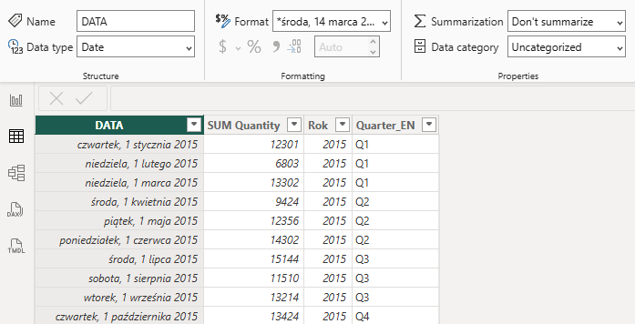

**SCREEN 21:** properties of the DATA column in table Q4 (Date type, no aggregation)

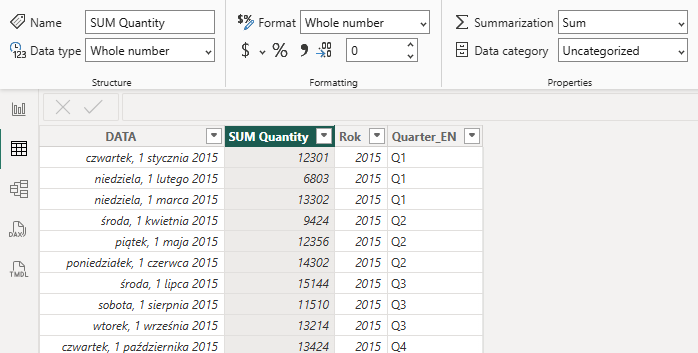

**SCREEN 22:** properties of the SUM Quantity column in table Q4 (whole number, Sum aggregation)

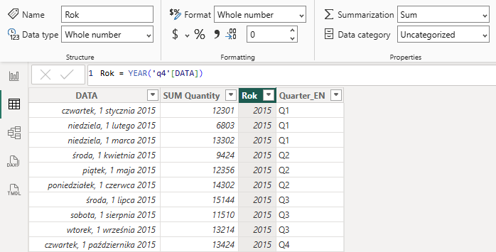

**SCREEN 23:** properties of the calculated Rok column in table Q4, with the DAX formula in the formula bar

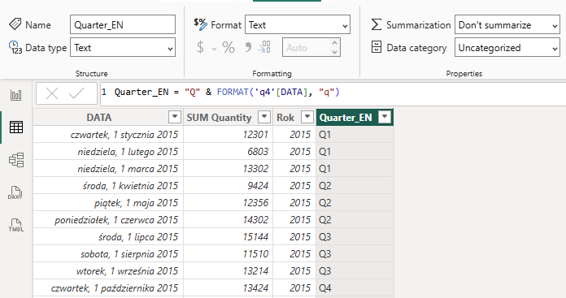

**SCREEN 24:** properties of the calculated Quarter_EN column in table Q4, with the DAX formula in the formula bar

I checked the naming and format of the columns.

The year_month column from SQL returned a result as text in a "year-month" format (e.g. "2015-1"). In Power BI I changed this column's type to Date and, while at it, manually renamed it to DATA. Power BI automatically interpreted the text representation of the year and month as a date, defaulting to the first day of the given month (hence the table shows, for example, "1 January 2015", "1 February 2015"). This did not entirely suit me, since I wanted to sort the data by quarter and year, and the automatically assigned day of the month had no real meaning in this context. Thanks to this conversion, instead of a text label, I now have a real, chronologically sortable date, on which I can further build calculated columns.

For that reason I additionally created two calculated columns (DAX) in Power BI:

- Rok = YEAR('q4'[DATA]) - extracts just the year from the full date.
- Quarter_EN = "Q" & FORMAT('q4'[DATA], "q") - extracts the quarter number from the date and assembles it into a readable text label (e.g. "Q1", "Q2").

Thanks to this I can now group the quantity of goods sold both by year and by quarter. Neither of these could be conveniently pulled directly from the DATA column alone at the visual level.

I set the SUM Quantity column as a whole number with Sum aggregation, for the same reason as in table Q2: it is the sum of units sold, so summing it makes full business sense.

### Table q5

I named the last table q5 and loaded into it a CSV file generated from the query below, aggregating the average discount, revenue, and quantity sold by month:

```sql
SELECT CONCAT(YEAR(order_date), '-', MONTH(order_date)) AS year_month,CAST(ROUND(AVG(discount_pct), 2) AS decimal(10,2)) AS AVG_DISCOUNT, SUM(revenue) AS SUM_REVENUE, SUM(quantity) AS SUM_QUANTITY
FROM seasonality_VS_margin
GROUP BY YEAR(order_date), MONTH(order_date)
ORDER BY YEAR(order_date),  MONTH(order_date);
```

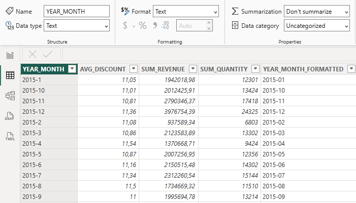

**SCREEN 25:** properties of the YEAR_MONTH column in table q5 (text, no aggregation)

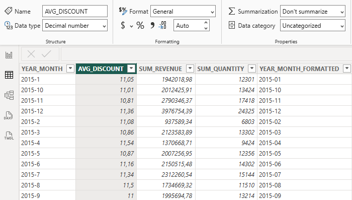

**SCREEN 26:** properties of the AVG_DISCOUNT column in table q5 (decimal number, Don't summarize aggregation)

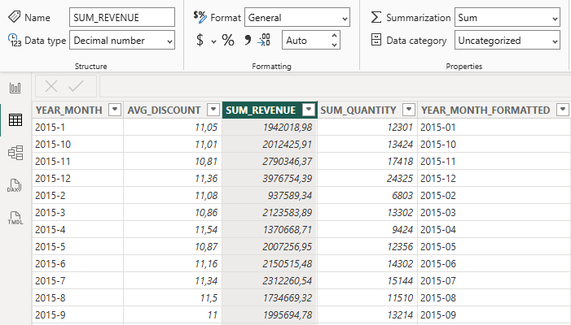

**SCREEN 27:** properties of the SUM_REVENUE column in table q5 (decimal number, Sum aggregation)

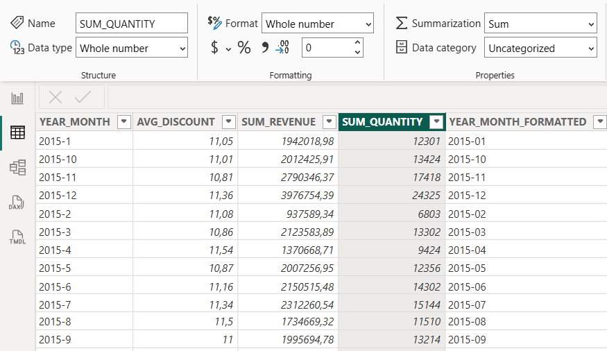

**SCREEN 28:** properties of the SUM_QUANTITY column in table q5 (whole number, Sum aggregation)

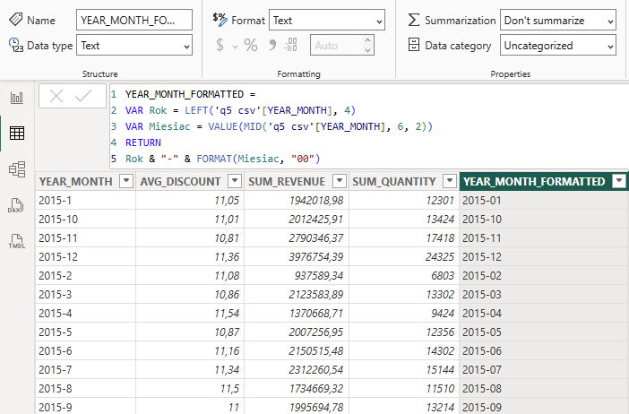

**SCREEN 29:** properties of the calculated YEAR_MONTH_FORMATTED column in table q5, with the DAX formula in the formula bar

I checked the naming and format of the columns.

As with the previous tables, the YEAR_MONTH column from SQL returned a result as text in a "year-month" format (e.g. "2015-1"). This time, however, unlike with Q4, I decided not to convert it to the Date type. On import, Power BI automatically recognised this column as a full calendar date (e.g. turning "2015-1" into "1 January 2015"), which I did not want. I wanted a year-month label, not a specific day. So I left the column as text.

The text itself had a drawback, though: it sorted alphabetically rather than chronologically, e.g. "2015-10" ends up before "2015-2", because the character "1" comes alphabetically before "2". To fix this, I added a calculated column (DAX):

```dax
YEAR_MONTH_FORMATTED = 
 VAR Rok = LEFT('q5 csv'[YEAR_MONTH], 4)
 VAR Miesiac = VALUE(MID('q5 csv'[YEAR_MONTH], 6, 2))
 RETURN
 Rok & "-" & FORMAT(Miesiac, "00")
```

This column pads the month with a leading zero (e.g. "2015-1" -> "2015-01"), which solves the sorting problem described above and ensures the correct chronology on the chart.

I set the SUM_QUANTITY column as a whole number with Sum aggregation, for the same reason as in tables Q2 and Q4: it is the sum of units sold, so summing it makes full business sense.

I set the AVG_DISCOUNT column as a decimal number with Don't summarize aggregation, the same as AVG_UNIT_PRICE in table Q2: it is already a calculated average from SQL, so any additional summing or averaging by Power BI would produce a statistically meaningless "average of averages".

### Dashboard layout

The dashboard consists of two pages: Review and Details. I chose this split because putting all the charts and cards on a single page made the dashboard hard to read. Too many elements at once made it difficult to quickly take in the conclusions.

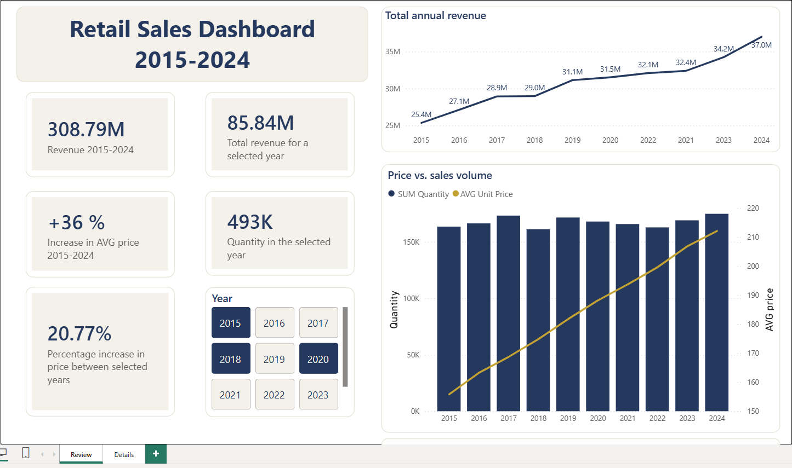

**SCREEN 30:** the dashboard's Review page

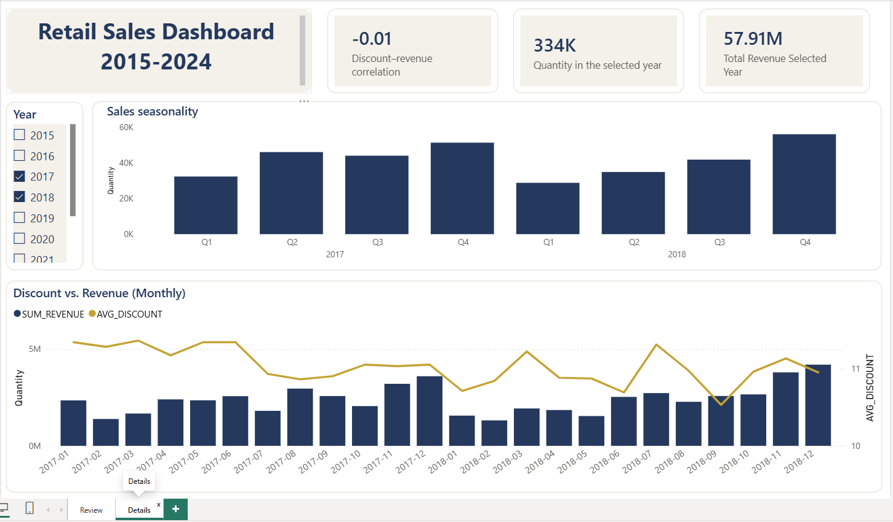

**SCREEN 31:** the dashboard's Details page

The Review page contains the most important information in a nutshell: KPI cards with total revenue, the price increase over 2015-2024, and the revenue/quantity for the selected year, alongside two trend charts (annual revenue, and a comparison of sales volume against the average price). This is the page someone looks at first to get an overall picture of the situation.

The Details page expands on selected threads in more depth: sales seasonality broken down by quarter, and the relationship between discount and revenue on a monthly basis, together with a card showing the correlation coefficient between discount and revenue.

I based the dashboard's colour scheme on a navy-and-gold palette: cards in a muted, cream shade, and charts in deep navy with a gold accent (the discount/average price line); this makes the whole thing look consistent and elegant, without the aggressive, bright colours typical of Power BI's default themes.

The first chart on the Review page shows annual revenue over 2015-2024, built from table Q1. Revenue grows across the whole period analysed, from 25.4M in 2015 to 37.0M in 2024, i.e. by about 46%. The growth is not uniform, though: the chart shows two moments where it clearly slows down, and one actual decline.

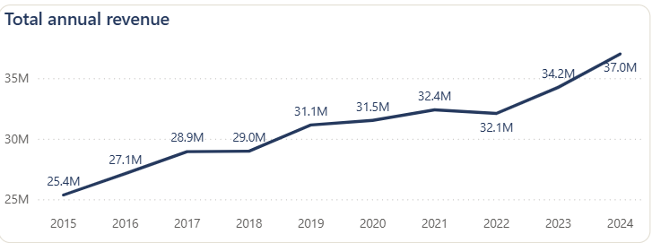

**SCREEN 32:** the Total annual revenue chart (annual revenue 2015-2024), Review page

The first such moment is 2017-2018, where revenue practically stands still (28.9M versus 29.0M, a rise of just 0.1M). I found no external cause for this; according to most sources, 2018 was a good year economically, so for now I am leaving this as a small, unexplained anomaly, though one worth investigating further.

The second moment is 2019-2021, where revenue keeps growing, but noticeably more slowly than in the surrounding years (31.1M, 31.5M, 32.4M, i.e. increases of a few hundred thousand instead of several million as in the other years). This period coincides with the COVID-19 pandemic. I interpret this as a good sign rather than a problem: the company did not record a decline, only a slowdown in the pace of growth, which points to resilience through the crisis.

The third and most pronounced moment is the decline in 2022 (from 32.4M to 32.1M), the only actual drop in revenue across the whole decade. Here the cause may be the outbreak of the war in Ukraine, the energy shock, and the surge in inflation, factors that hit European trade hard (and the data in this project covers European markets, including Poland, France, Austria, and Italy). A drop in units sold makes sense in this context: customers cut spending in the face of a crisis.

After 2022, growth picks up again (34.2M in 2023, 37.0M in 2024), which suggests the decline was a reaction to a specific, one-off event rather than the start of a lasting change in trend.

The next chart compares the average unit price with the quantity of products sold in each year, built from table Q2. This same chart directly answers two business questions: "Are prices really growing? (YoY)" and "Is revenue growth driven by volume or price?"

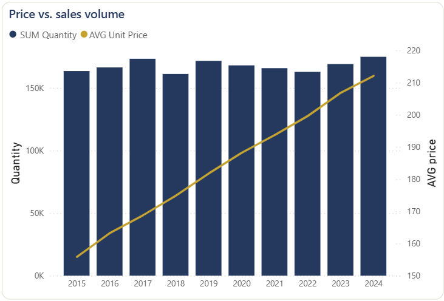

**SCREEN 33:** the Price vs. sales volume chart, Review page

The average unit price rises continuously throughout the whole period analysed, from around 155 in 2015 to around 212 in 2024, i.e. by about 37%, with no interruptions or reversals. The answer to the first question is therefore unambiguous: yes, prices really are rising, and doing so systematically, year after year.

The quantity of products sold, on the other hand, stays at a similar level throughout the period, oscillating in a range of roughly 161-180 thousand units per year, with no clear upward trend. There is a clear dip visible in 2018, though: quantity drops to 169,992 units, down from 180,504 units the year before. As I already described earlier, I found no external cause for this case either; according to most sources, 2018 was a good year economically. A similar, even more pronounced dip is visible in 2022 (167,421 units, the lowest result of the whole decade). Here the likely influence was the outbreak of the war in Ukraine, the energy shock, and the surge in inflation, which hit European trade hard.

Since price keeps rising without interruption while the quantity sold stays at a comparable level year over year, the answer to the second question is also clear: revenue growth is driven by rising prices, not by a higher sales volume. This is clearest in 2018, where the number of units sold drops below the 2017 level, and yet price keeps rising, which confirms that it is price, not volume, that is the real driver of revenue growth.

That said, I think it's worth considering why the price keeps rising while the quantity of items sold stands still. This is a rather unusual pattern, one that would be worth investigating in more depth.

In this part of the dashboard I added six summary tiles highlighting the most important information from the data, built on tables q1 and q2.

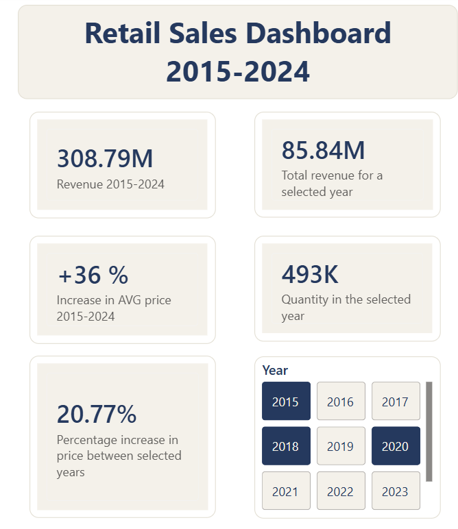

**SCREEN 34:** the six KPI tiles on the Review page

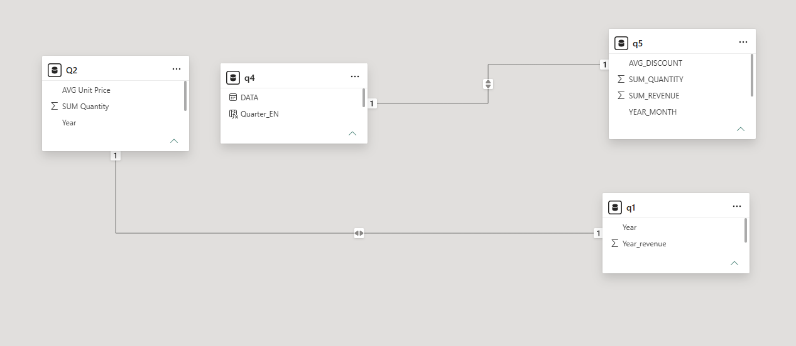

**SCREEN 35:** Model view, relationships between tables q1, Q2, q4 and q5

The dynamic tiles (Total revenue for a selected year, Quantity in the selected year, Percentage increase in price between selected years) are directly tied to the Year column in table q1, which the shared Year filter is built on.

Thanks to the relationship I created linking q1 to Q2 in Model view (see Screen 35), selecting a year in the filter automatically filters the data in both tables, so these three tiles react live to the selection.

For the percentage increase in price between the selected years, I created the measure:

```dax
ProcentowyWzrostCeny = 
VAR MinYear = MIN('Q2'[Year])
VAR MaxYear = MAX('Q2'[Year])
VAR CenaPoczatkowa = CALCULATE(AVERAGE('Q2'[AVG Unit Price]), 'Q2'[Year] = MinYear)
VAR CenaKoncowa = CALCULATE(AVERAGE('Q2'[AVG Unit Price]), 'Q2'[Year] = MaxYear)
RETURN
DIVIDE(CenaKoncowa - CenaPoczatkowa, CenaPoczatkowa)
```

It finds the earliest and latest year among those currently selected in the filter and calculates the percentage difference in average price between them. This makes it fully flexible: when several years are selected at once, it shows the price increase exactly between the two extreme ones (e.g. for 2015, 2018, and 2020 it will show the increase between 2015 and 2020), and when a single year is selected it shows 0%, because the earliest and latest selected year are then the same, which is logically correct rather than a bug.

The fixed tiles (Revenue 2015-2024 and Increase in AVG price 2015-2024) are meant to always show the result for the whole period analysed, regardless of what is currently selected in the Year filter.

The Revenue 2015-2024 tile refers directly to the Year_revenue column from table q1 (with no additional measure), and I disabled its interaction with the Year slicer via Format -> Edit interactions (setting "None" for this filter on this visual).

For the Increase in AVG price 2015-2024 tile, on the other hand, I used a simple, fixed text value saved as a measure:

```dax
WzrostCenyText = "+36 %"
```

Just as with the previous tile, I disabled its interaction with the Year slicer, so this tile also always shows the same result for the whole 2015-2024 period, regardless of which year someone selects in the filter. This combination gives two things at once: a fixed point of reference (revenue and price increase for the whole period analysed, always visible, regardless of the filter selection) and freedom to explore (selecting any years immediately recalculates the other three tiles and shows the revenue, quantity sold, and price increase for exactly that period).

### Details page

The first chart on the Details page shows sales quantity broken down by quarter. It is built on table q4. It is meant to answer the question: "Is there seasonality in sales?". I used the columns Quarter_EN (axis, quarter in Q1-Q4 format), Rok (grouping consecutive years), and SUM Quantity (value, quantity of units sold). The Details page also has a shared Year slicer, which lets you pick a specific year and see the quantity sold for just that year; I will describe how this mechanism works in more detail at a later stage.

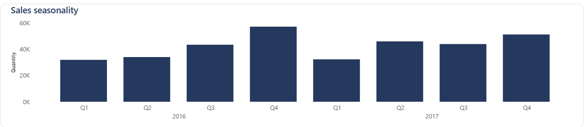

**SCREEN 36:** the Sales seasonality chart broken down by quarter, 2016-2017, Details page

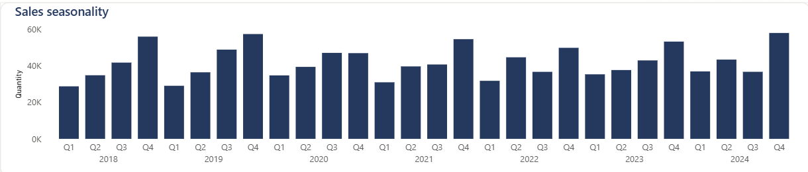

**SCREEN 37:** the Sales seasonality chart broken down by quarter, 2018-2024, Details page

The chart shows a clear, recurring seasonal pattern. In almost every year, sales rise from quarter to quarter, from the lowest level in Q1 to the highest in Q4, which is consistently the strongest quarter across the whole period analysed. The only exception is 2020, where Q3 and Q4 are at a similar level, which coincides with the COVID-19 pandemic period and the overall slowdown in growth also visible on the annual revenue chart.

In a few years (2017, 2022, and 2024), however, the pattern is not fully regular: Q2 comes out higher than Q3, so the growth within the year is not strictly linear. 2022 coincides with the previously described likely revenue decline (the outbreak of the war in Ukraine, the energy shock), which may partly explain this disruption, whereas for 2017 and 2024 I do not currently have a clear explanation, and I treat this as a thread for possible further investigation.

The recurrence of the peak in Q4 suggests that this is a seasonal effect, most likely tied to increased pre-holiday shopping, rather than a one-off promotion or coincidence, given that it occurs consistently in almost every year individually.

To sum up: is there seasonality in sales? Yes. Sales show a clear, recurring seasonal pattern, the quantity sold generally rises from quarter to quarter within a given year, and Q4 is the strongest quarter in almost every year from 2015 to 2024 (the only exception being 2020, where Q3 and Q4 are at a similar level, which is likely linked to COVID-19). At the monthly level, December is consistently the strongest month, which points to a genuine seasonal effect, most likely tied to holiday demand, rather than random variation.

The second chart on the Details page shows the relationship between discount and revenue on a monthly basis and is built on table q5. It is meant to answer the question: "Do promotions have a negative impact on profit?".

I used the columns AVG_DISCOUNT (average discount, line on the right axis), SUM_REVENUE (revenue, bars on the left axis), and YEAR_MONTH_FORMATTED as the category axis, i.e. the same calculated column I described earlier for table q5.

The chart uses the same shared Year slicer as the other visuals on this page, letting you pick the years of interest and compare the course of discount and revenue for exactly those years; the screenshot below has the years 2016 and 2017 selected.

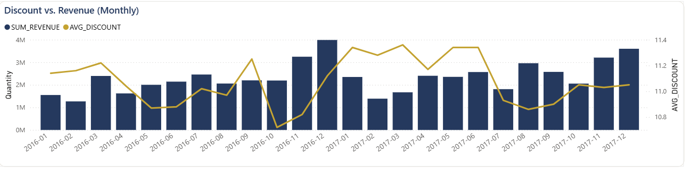

**SCREEN 38:** the Discount vs. Revenue (Monthly) chart, Details page

The average discount stays within a narrow range throughout the whole period, roughly 10-11.5%, with practically no major fluctuations, whereas revenue changes much more strongly from month to month, with its peaks usually falling at the end of the year, which lines up with the seasonality described for the previous chart. The discount line does not track the revenue bars: in none of the three years shown is a rise in revenue preceded by, or accompanied by, a rise in discount.

This indicates that increases in revenue stem from sales seasonality (the Q4/December effect) rather than from discount policy. This is also confirmed by the Pearson correlation coefficient calculated in SQL between the average monthly discount and revenue, which came out at -0.01, i.e. practically zero, meaning there is no meaningful linear relationship between the discount level and the amount of revenue. Discounting therefore has no negative impact on profit.

The Details page also has three summary tiles, built on three different tables.

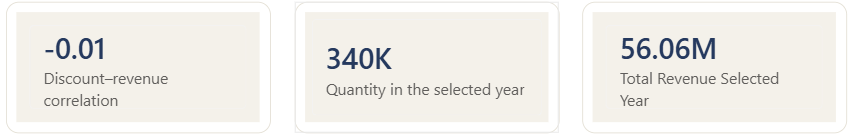

**SCREEN 39:** the three summary tiles on the Details page

The first tile, Discount-revenue correlation, is fixed and refers to table q5. It is simply the hard-coded value of the Pearson correlation coefficient, calculated earlier in SQL:

```dax
Korelacja rabat–przychód = -0.01
```

Since this is just a plain numeric constant, not an aggregation of any column, the tile does not react to the Year slicer, the same as the other fixed values in this report.

The second tile, Quantity in the selected year, is dynamic and refers to the SUM Quantity column in table q4. Since the Year slicer on this page filters table q4 directly, the tile reacts live to the year selection, just like the sales seasonality chart described above.

The third tile, Total Revenue Selected Year, is tied to table q1 and uses the measure:

```dax
Total Revenue Selected Year = 
VAR WybraneLata = SELECTCOLUMNS(VALUES('q4'[DATA]), "Rok", YEAR('q4'[DATA]))
RETURN
CALCULATE(
    SUM('q1'[Year_revenue]),
    TREATAS(WybraneLata, 'q1'[Year])
)
```

Tables q1 and q4 are not connected by any relationship in the model (see Screen 35), so selecting a year in the Year slicer, which filters q4, would not by itself affect the revenue from q1. This measure solves that problem manually: it first reads which years are currently visible in the filtered q4[DATA] column, and then, using the TREATAS function, carries that same set of years over as a filter onto the q1[Year] column, as if a relationship existed between them, and only then sums Year_revenue on the table q1 filtered in this way. I added this tile on the Details page because it immediately gives the user extra, useful information about revenue for the selected period, without having to jump over to the Review page.

The Year slicer on the Details page therefore works somewhat differently from the one on the Review page: here it filters table q4 directly, which naturally covers both the seasonality chart and the Quantity in the selected year tile, while for table q1 its selection is additionally carried over precisely through the Total Revenue Selected Year measure described above.

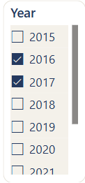

**SCREEN 40:** the Year slicer on the Details page

### Summary

Revenue over 2015-2024 grew by about 46% (25.4M -> 37.0M), but this growth was not uniform. There is visible stagnation in 2017-2018 and a clear slowdown in 2019-2021 (most likely due to the pandemic), and the only real decline in 2022, most likely influenced by the war in Ukraine and the energy shock.

Price vs. volume: price rises without interruption across the whole decade, by about 37%. The quantity sold, however, stands still. Revenue growth is therefore driven by price, not by volume.

Seasonality: a clear, recurring pattern. Q4/December is the strongest almost every year (exception: 2020, COVID). In 2017, 2022, and 2024, Q2 exceeds Q3, breaking the regularity.

Discounts: stable at 10-11.5% throughout the whole period, with a correlation to revenue that is practically zero (-0.01), which clearly shows that discounts do not drive sales.

Based on the analysis above, I think it would be worth looking into, going forward:

- The stagnation in 2017-2018, the only moment without a clear external cause (COVID, war).
- Why Q2 is larger than Q3 in 2017/2022/2024.
- Price vs. shopping basket: since price is rising while volume is not, it would be worth checking whether this is a product-mix effect (more expensive categories gaining share) or a genuine price increase within the same products.

Interesting nuances worth investigating further:

- Whether the seasonal Q4 pattern differs between product categories, i.e. whether there are categories with no holiday peak at all.
- It would also be worth strengthening the data model: q1/Q2 and q4/q5 are two disconnected "islands", linked only ad hoc via TREATAS. Ideally, a proper date table (a calendar) should be added as a shared reference point, instead of working around it with TREATAS/SELECTCOLUMNS.

